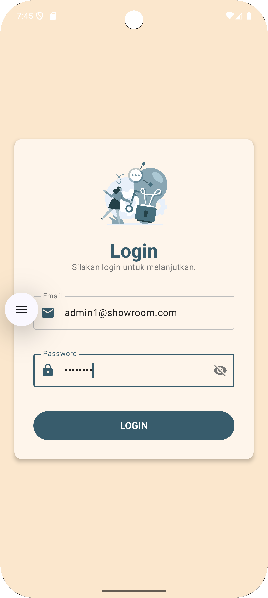
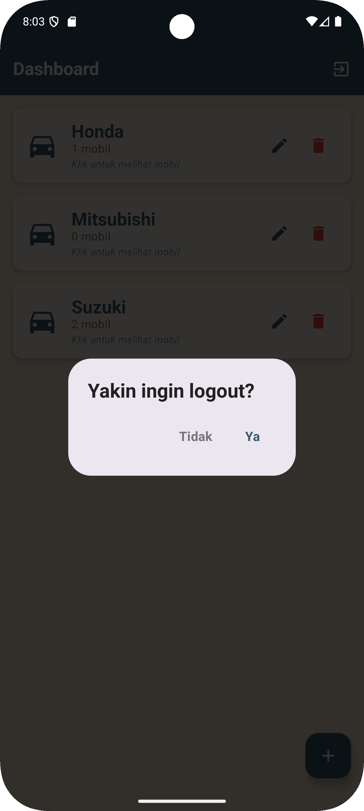
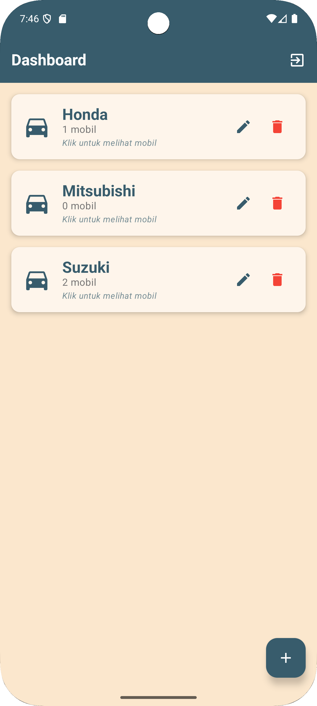
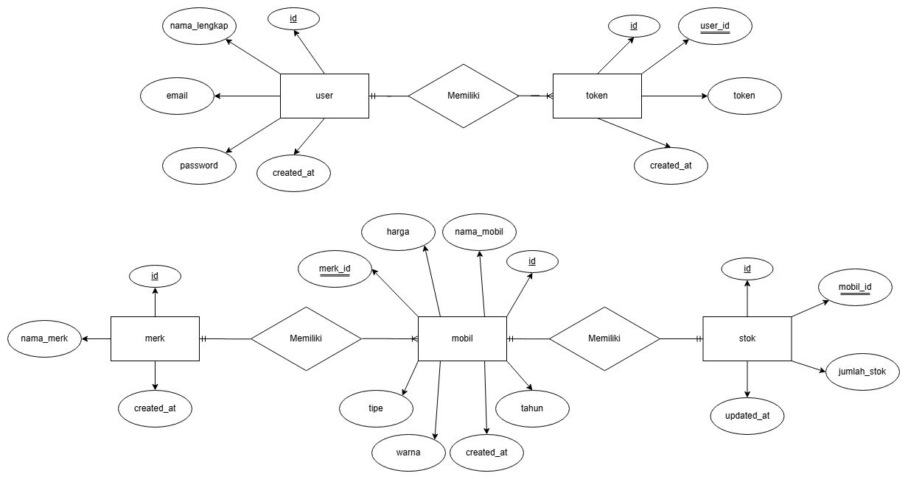
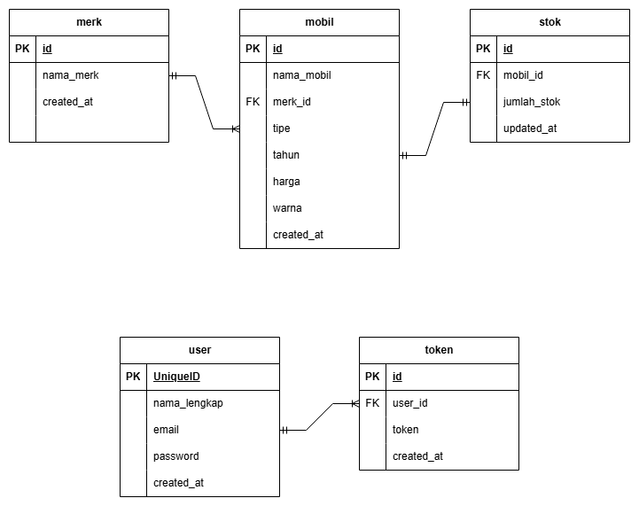

# Aplikasi Manajemen Inventaris Showroom Mobil

Aplikasi Android untuk mengelola inventaris mobil di showroom menggunakan Kotlin Jetpack Compose dengan backend PHP + MySQL.

---

## 🔗 Repository Structure
```
ProjectTAInventarisMobil/
├── master (branch) - Android Kotlin UI + Documentation
└── backend (branch) - PHP Backend API
```

**Untuk melihat kode Backend:** Switch ke branch `backend` atau bisa diakses kode lengkapnya melalui [link berikut](https://github.com/salmaarayyan/ProjectTAInventarisMobil/tree/backend).

## 📱 Fitur Aplikasi

- Login & Logout dengan JWT Authentication
- Manajemen Merk Mobil (CRUD)
- Manajemen Data Mobil (CRUD)
- Update Stok Mobil (Tambah/Kurangi)
- Validasi duplikasi data

---

## 📖 User Manual (Panduan Pengguna)

### 1. Login & Logout

**Login:**
1. Buka aplikasi
2. Masukkan email dan password
3. Klik tombol "LOGIN"
4. Jika berhasil, akan masuk ke Dashboard

|                     Sebelum Login                      |                           Setelah Login                           |
|:------------------------------------------------------:|:-----------------------------------------------------------------:|
|  |  |

**Logout:**
1. Di halaman Dashboard, klik icon logout (atas kanan)
2. Konfirmasi logout
3. Kembali ke halaman Login

|           Validasi Logout            |                 Setelah Logout                  |
|:------------------------------------:|:-----------------------------------------------:|
|  |  |

### 2. Mengelola Merk Mobil

**Tambah Merk:**
1. Di Dashboard, klik tombol FAB (+) bawah kanan
2. Masukkan nama merk
3. Klik "SIMPAN"

|           Sebelum Penambahan            |             Pop-up Tambah Merk              |                   Setelah Penambahan                   |
|:---------------------------------------:|:-------------------------------------------:|:------------------------------------------------------:|
|  |  |  |

**Edit Merk:**
1. Di card merk, klik icon pensil
2. Ubah nama merk
3. Klik "SIMPAN"

|            Sebelum Perubahan            |             Pop-up Edit Merk              |                  Setelah Perubahan                   |
|:---------------------------------------:|:-----------------------------------------:|:----------------------------------------------------:|
|  |  |  |

**Hapus Merk:**
1. Di card merk, klik icon sampah
2. Konfirmasi penghapusan
3. Semua mobil dengan merk ini akan terhapus

|                 Sebelum Penghapusan                  |               Validasi Delete               |                  Setelah Penghapusan                   |
|:----------------------------------------------------:|:-------------------------------------------:|:------------------------------------------------------:|
|  |  |  |

**Lihat Mobil per Merk:**
1. Klik card merk
2. Tampil daftar mobil merk tersebut

|                          Daftar Mobil Sesuai Merk                           | 
|:---------------------------------------------------------------------------:|
|  |

### 3. Mengelola Data Mobil

**Tambah Mobil:**
1. Di halaman Daftar Mobil, klik FAB (+)
2. Isi form:
    - Nama Mobil
    - Tipe (pilih dari dropdown)
    - Tahun
    - Harga
    - Warna
    - Stok Awal
3. Klik "SIMPAN"

|                    Sebelum Penambahan                    |              Form Tambah Mobil               |                   Setelah Penambahan                    |
|:--------------------------------------------------------:|:--------------------------------------------:|:-------------------------------------------------------:|
|  |  |  |

**Edit Mobil:**
1. Di card mobil, klik tombol "DETAIL"
2. Klik tombol "EDIT MOBIL"
3. Ubah data yang diperlukan
4. Klik "SIMPAN"

|              Sebelum Perubahan               |              Form Edit Mobil               |                   Setelah Perubahan                   |
|:--------------------------------------------:|:------------------------------------------:|:-----------------------------------------------------:|
|  |  |  |

**Hapus Mobil:**
1. Di card mobil, klik tombol "HAPUS"
2. Konfirmasi penghapusan

|            Sebelum Penghapusan             |               Validasi Delete                |                   Setelah Penghapusan                   |
|:------------------------------------------:|:--------------------------------------------:|:-------------------------------------------------------:|
|  |  |  |

**Lihat Detail Mobil:**
1. Di card mobil, klik tombol "DETAIL"
2. Tampil informasi lengkap mobil

|                          Detail Mobil                           | 
|:---------------------------------------------------------------:|
|  |

### 4. Update Stok Mobil

**Tambah Stok:**
1. Di card mobil, klik tombol hijau (+)
2. Konfirmasi penambahan
3. Stok bertambah 1

|                    Sebelum Penambahan                    |             Validasi Penambahan             |                   Setelah Penambahan                   |
|:--------------------------------------------------------:|:-------------------------------------------:|:------------------------------------------------------:|
|  |  |  |

**Kurangi Stok:**
1. Di card mobil, klik tombol merah (-)
2. Konfirmasi pengurangan
3. Stok berkurang 1
4. *Tombol disabled jika stok = 0*

|                  Sebelum Pengurangan                   |             Validasi Pengurangan             |                   Setelah Pengurangan                   |
|:------------------------------------------------------:|:--------------------------------------------:|:-------------------------------------------------------:|
|  |  |  |

---

## 📊 Technical Documentation

### Entity Relationship Diagram (ERD)


### Flowchart Aplikasi


### Use Case Diagram


### Activity Diagram Login


### Activity Diagram Create Merk


### Activity Diagram Edit Merk


### Activity Diagram Delete Merk


### Activity Diagram Create Mobil


### Activity Diagram Edit Mobil


### Activity Diagram Delete Mobil


### Activity Diagram Tambah Stok Mobil


### Activity Diagram Kurangi Stok Mobil


### Relasi Antar Tabel (RAT)


---

## 📋 Kamus Data

### Tabel: user
| Field | Type | Length | Null | Default | Keterangan |
|-------|------|--------|------|---------|------------|
| id | int | 11 | NO | AUTO_INCREMENT | Primary Key |
| nama_lengkap | varchar | 100 | NO | - | Nama lengkap admin |
| email | varchar | 100 | NO | - | Email (unique) |
| password | varchar | 255 | NO | - | Password (hashed bcrypt) |
| created_at | timestamp | - | YES | CURRENT_TIMESTAMP | Waktu dibuat |

**Contoh Data:**
```
id: 1
nama_lengkap: Admin Showroom
email: admin1@showroom.com
password: $2y$10$... (hashed)
```

---

### Tabel: token
| Field | Type | Length | Null | Default | Keterangan |
|-------|------|--------|------|---------|------------|
| id | int | 11 | NO | AUTO_INCREMENT | Primary Key |
| user_id | int | 11 | NO | - | Foreign Key ke user.id |
| token | text | - | NO | - | JWT Token |
| created_at | timestamp | - | YES | CURRENT_TIMESTAMP | Waktu dibuat |
| expired_at | timestamp | - | YES | NULL | Waktu expired |

**Relasi:** token.user_id → user.id (CASCADE DELETE)

---

### Tabel: merk
| Field | Type | Length | Null | Default | Keterangan |
|-------|------|--------|------|---------|------------|
| id | int | 11 | NO | AUTO_INCREMENT | Primary Key |
| nama_merk | varchar | 50 | NO | - | Nama merk mobil (unique, case-insensitive) |
| created_at | timestamp | - | YES | CURRENT_TIMESTAMP | Waktu dibuat |

**Contoh Data:**
```
id: 1
nama_merk: Toyota
created_at: 2024-12-25 10:00:00
```

---

### Tabel: mobil
| Field | Type | Length | Null | Default | Keterangan |
|-------|------|--------|------|---------|------------|
| id | int | 11 | NO | AUTO_INCREMENT | Primary Key |
| nama_mobil | varchar | 100 | NO | - | Nama mobil |
| merk_id | int | 11 | NO | - | Foreign Key ke merk.id |
| tipe | varchar | 50 | NO | - | Tipe mobil (Sedan, SUV, MPV, dll) |
| tahun | int | 4 | NO | - | Tahun produksi |
| harga | decimal | 15,2 | NO | - | Harga mobil |
| warna | varchar | 30 | NO | - | Warna mobil |
| created_at | timestamp | - | YES | CURRENT_TIMESTAMP | Waktu dibuat |

**Relasi:** mobil.merk_id → merk.id (CASCADE DELETE)

**Validasi Duplikasi:** Kombinasi (nama_mobil + merk_id + warna + tahun) harus unique

**Contoh Data:**
```
id: 1
nama_mobil: Avanza
merk_id: 1 (Toyota)
tipe: MPV
tahun: 2023
harga: 250000000.00
warna: Putih
```

---

### Tabel: stok
| Field | Type | Length | Null | Default | Keterangan |
|-------|------|--------|------|---------|------------|
| id | int | 11 | NO | AUTO_INCREMENT | Primary Key |
| mobil_id | int | 11 | NO | - | Foreign Key ke mobil.id |
| jumlah_stok | int | 11 | NO | 0 | Jumlah stok mobil |
| updated_at | timestamp | - | YES | CURRENT_TIMESTAMP ON UPDATE | Waktu update terakhir |

**Relasi:** stok.mobil_id → mobil.id (CASCADE DELETE)

**Contoh Data:**
```
id: 1
mobil_id: 1
jumlah_stok: 15
updated_at: 2024-12-25 15:30:00
```

---

## 🛠️ Installation Guide

### Minimum Requirements

**Hardware:**
- RAM: 4 GB (recommended 8 GB)
- Storage: 2 GB free space
- Android Device/Emulator: Android 7.0 (API 24) or higher

**Software:**
- Android Studio
- XAMPP (PHP 8.x + MySQL)

---

### Setup Backend (XAMPP & Database)

**1. Install XAMPP:**
- Download dari https://www.apachefriends.org/
- Install di C:\xampp (Windows) atau /Applications/XAMPP (Mac)

**2. Setup Database:**
- Buka XAMPP Control Panel
- Start Apache & MySQL
- Buka browser: http://localhost/phpmyadmin
- Create database: `showroom_db`
- Import SQL file (jika ada) atau buat tabel manual sesuai kamus data

**3. Konfigurasi Backend:**
- Edit `config/database.php`:
```php
$host = 'localhost';
$db_name = 'showroom_db';
$username = 'root';
$password = ''; // kosongkan jika default XAMPP
```

**4. Test Backend:**
- Buka Postman atau Thunder Client
- Method: **POST**
- URL: `http://localhost/showroom-backend/api/login.php`
- Body (JSON):
```json
{
  "email": "admin1@showroom.com",
  "password": "admin123"
}
```
- Jika sukses, dapat response dengan token JWT

---

### Setup Android App

**1. Buka Project di Android Studio:**
- File → Open → pilih folder project
- Tunggu Gradle sync selesai

**2. Konfigurasi Base URL:**
- Buka `app/src/main/java/.../repositori/ContainerApp.kt`
- BASE_URL sudah diset untuk emulator:
```kotlin
private const val BASE_URL = "http://10.0.2.2/showroom-backend/api/"
```
- **Jika pakai real device**, ganti dengan IP lokal komputer kamu:
```kotlin
private const val BASE_URL = "http://192.168.x.x/showroom-backend/api/"
```

**3. Build & Run:**
- Connect Android device atau start emulator
- Click Run (Shift+F10)
- App akan terinstall otomatis

**4. Login:**
- Email: `admin1@showroom.com`
- Password: `admin123`

---

## 👨‍💻 Developer

**Nama:** Salmaa Rifhani Rayyan  
**NIM:** 20230140082 
**Universitas:** UMY  
**Program Studi:** Teknologi Informasi

---

## 📝 License

This project is for educational purposes (Tugas Akhir).

---

